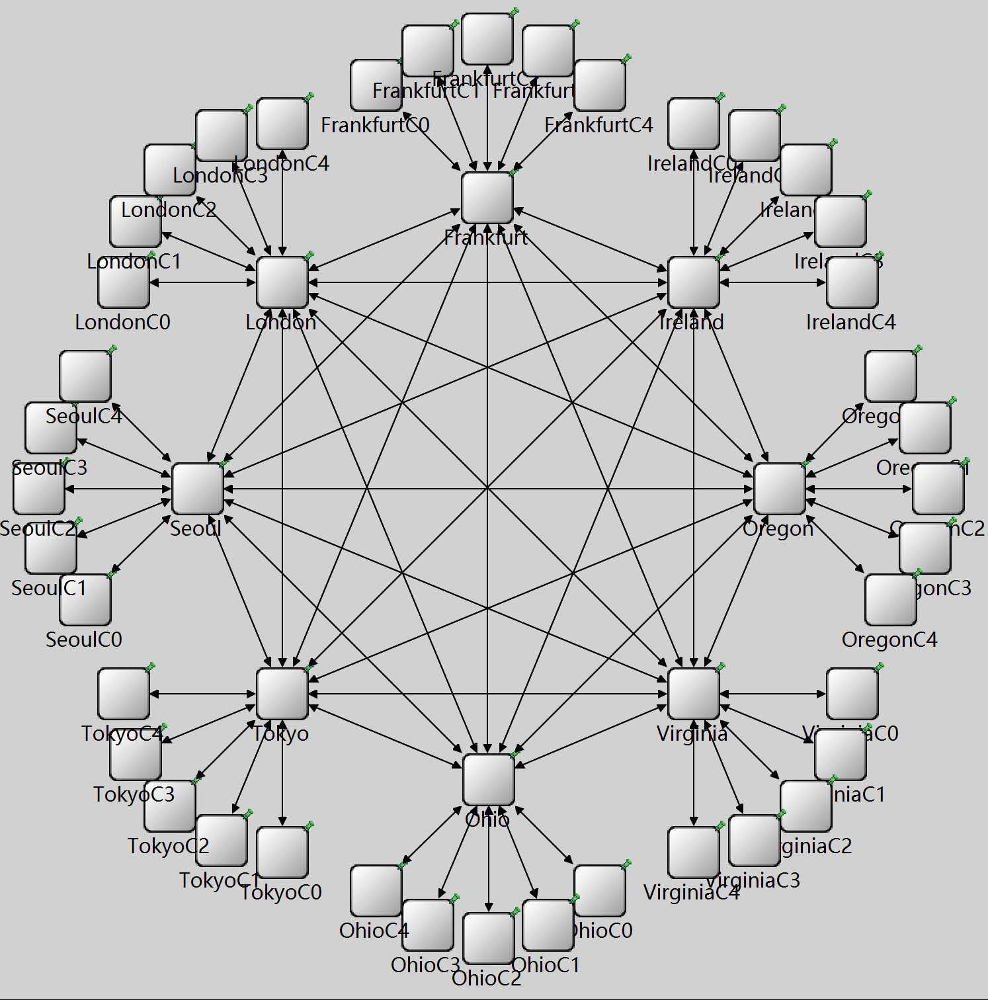

# COMPSCI 650 Project: An OMNeT++ Simulation of Geo-Distributed Training via Subservers

Project Report: [Train Large Models Across the World: Accelerating Training on Geo-Distributed Heterogeneous Clusters via Subservers and Bandwidth-Aware Collective Communication](reports/CS650_Project/CS650_Project.pdf)

Presentation: [Slides](reports/CS650_Project_Presentation/CS650_Project_Presentation.pdf)

# The Subserver Topology

This project introduces and simulates a novel **subserver-centric training framework** designed to accelerate training on heterogeneous, geo-distributed clusters.

Our core idea is a **two-tier network topology**:
1.  **Metropolitan Clusters:** Multiple local compute clusters (e.g., in one city) with fast internal links.
2.  **Subservers:** A regional hub that aggregates traffic from all its local clusters.
3.  **Global Pipeline:** These subservers then form a high-speed ring, exchanging gradients and activations over long-haul optical links.

<p align="center">
  
</p>

This architecture allows us to apply a **hybrid parallelism strategy** that uses the best approach for each network tier:
* **Across Subservers (WAN):** We use **Pipeline Parallelism**. The model layers are split across the subservers, which stream activations forward and gradients back. This approach is less communication-intensive and effectively hides the high inter-continental latency.
* **Within Clusters (LAN):** We use a mix of **Data Parallelism** and **Tensor Parallelism**. Inside the fast metro-area network (<0.15ms RTT), we can afford fine-grained, synchronous operations like AllReduce to fully utilize the high-bandwidth local fabrics.

# The OMNeT++ Simulation Model

This repository provides the high-fidelity OMNeT++ simulation built to model this architecture and measure its end-to-end performance.

The simulation models a network of **8 subservers** (representing AWS regions like Ohio, Virginia, Oregon, Ireland, Frankfurt, London, Seoul, and Tokyo) with **5 clients per subserver**. The topology is dynamically generated from CSV files containing **real-world network data**:
* **Inter-cluster links:** Latency and bandwidth data from AWS instance benchmarks.
* **Intra-cluster links:** Median fixed broadband latency and bandwidth from the Speedtest Global Index for each country.

## Key Components:
* `global` **Module:** Manages simulation parameters and computes an optimal ring ordering of subservers to minimize total communication time.
* `subserver` **Module:** The core of our topology. It distributes work (micro-batches) to its local clients, orchestrates the local AllReduce for data parallelism, and forwards pipelined data to the next subserver in the ring.
* `client` **Module:** Simulates a compute node (e.g., a GPU cluster). It receives work, simulates the local compute time (based on FLOPS), and uploads results.
* `PipelinedChannel` **Module:** A custom OMNeT++ channel that accurately models network links by accounting for both propagation delay (latency) and transmission delay (packet size / datarate), based on the $\alpha-\beta$ model.

# Key Findings from the Simulation

We configured the simulation to train a model with parameters matching **Llama 3.1 405B**. Our experiments yielded a critical insight:

**Network communication is the dominant bottleneck.**

With realistic network parameters, the FLOPS utilization was extremely low (e.g., **$3.12 \times 10^{-4}$** for a 10,000 micro-batch size).

As shown in Figure 12 of the report, decreasing the clients' compute power (FLOPS) had a negligible impact on the total training time, but FLOPS utilization *improved*. This strongly indicates that **training time is highly dominated by network communication costs**.

Our analysis concludes that while geo-distributed training is necessary, its feasibility on the *current* internet infrastructure is questionable. Significant advances in global network infrastructure or new algorithms more robust to high latency are required to unlock planet-scale model training.

# Regenerate `network.ned`

The `network.ned` file can be regenerated from the provided CSVs using the included Python script. From the `dist_ml` directory run:

```bash
python gen_ned.py
```

This will re-create `network.ned` using the CSV matrices. The script expects the CSV files to be present in the same directory.

# Build & Run

This project is intended to be built and launched from the OMNeT++ IDE (recommended workflow). The IDE handles message compilation, project makefiles, and running simulations with the selected configuration and GUI or command-line runners.

Typical IDE steps:

1. Open the OMNeT++ IDE and import or open this project folder (`dist_ml`).
2. If you edited `.msg` files, right-click the project and choose "Run make" or simply build the project using the IDE's build command — the IDE will invoke the proper make tool for your platform and regenerate `packet_m.cc`/`packet_m.h` as needed.
3. Run the simulation by selecting a configuration in `omnetpp.ini` (for example `General`) and choosing Run (GUI) or Run (Cmdenv) from the IDE. You can also launch individual configurations via the Run Configurations dialog.
